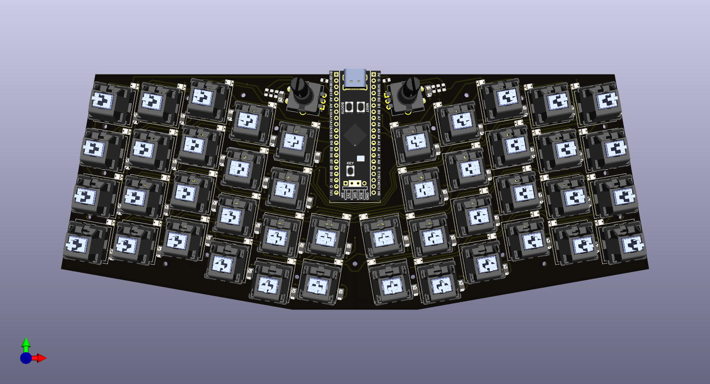

# blackpill-mechanical-keyboard
stm32f411ceu6 black pill 44 key mechanical keyboard, inspired by Keyboardio Atreus (keyboardio.io)

The project is complete, the PCBs are manufactured and tested. The binary firmware
is [here](https://github.com/vahidtaghiloo/qmk-firmware-build/releases/tag/test)
and the qmk modified firmware is [here](https://github.com/vahidtaghiloo/qmk_firmware/tree/master/keyboards/blackpill_mechanical_keyboard)

